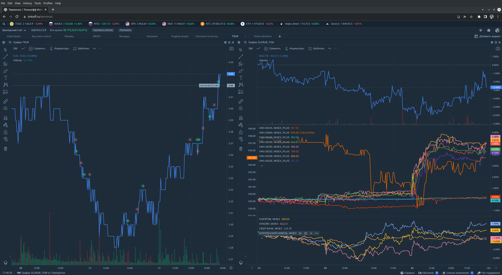

# TraderBot ([русская версия](README.ru.md))

This bot was participating in the [Tinkoff Invest Robot Contest](https://github.com/Tinkoff/invest-robot-contest) (no prize).

[](trading.png)

## Prerequisites
* Linux, macOS, Windows
* [Git](https://git-scm.com/downloads)
* [.NET SDK](https://dotnet.microsoft.com/download)

## Install
```
git clone https://github.com/linksplatform/Bot
cd Bot/csharp/TraderBot
dotnet restore
```

## Prepare

For the bot to work, you need to get a token. You can do this here: https://www.tinkoff.ru/invest/settings.

Token should be placed in `appsettings.json` file at `InvestApiSettings`/`AccessToken` key. Also set `TradingSettings`/`AccountIndex` to the index of the account to which the token has access. The list of accounts with their indices is written by the bot to the console at start-up.

## Start
```sh
dotnet run
```
To stop the bot, press Ctrl+C.

## Description

At the moment, the bot is able to:
* Place sell order at best price or buy order price;
* Place buy order at best price.

After placing the order, the bot will wait for the order to be filled. Then it will place the next order:
* After buy order is filled, the bot will place sell order at best price or buy order price;
* After sell order is filled, the bot will place buy order at best price.

You can configure the bot to trade ETF/cash pair at `TradingSettings`/`EtfTicker` and `TradingSettings`/`CashCurrency` keys in `appsettings.json` file.

In order to make the bot sell only with profit (+1 pt or for example +0.01) set `TradingSettings`/`AllowSamePriceSell` to `false`. This can limit the ability of the bot to follow the price (especially down).

## Strategy

This bot implements a simple scalping strategy.
It executes continuous loop of buying and selling sometimes making 1 pt of profit per iteration of buying and selling.
Works best on growing market and with least volotile asset.

Hypothesis:
```
It is possible to make more profit using this strategy
than with buy and hold strategy
due to effect of compound interest
on each buy and sell iteration with profit.
```

## Roadmap
- [x] Make a bot that can place buy and sell orders at best price on a single run
- [x] Make this bot work without restarts
- [x] Support moving buy order up
- [x] Optional support moving sell order down (up to equal to buy price)
- [ ] Add short trading mode
- [ ] Optimize the number of requests to the API
- [ ] Store all the data in the associative database ([Deep](https://github.com/deep-foundation) or [Doublets links storage](https://github.com/linksplatform/Data.Doublets))
